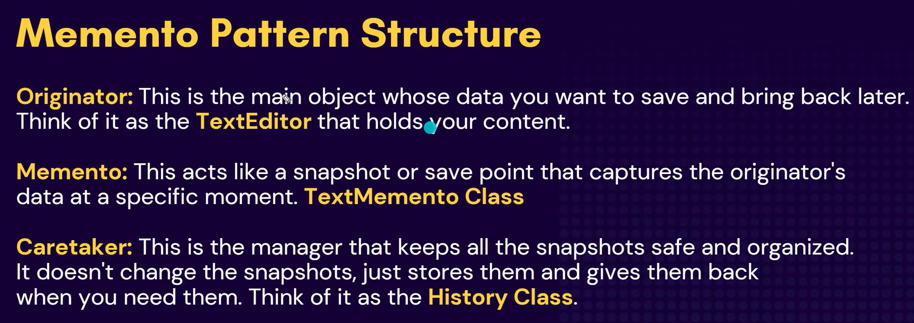
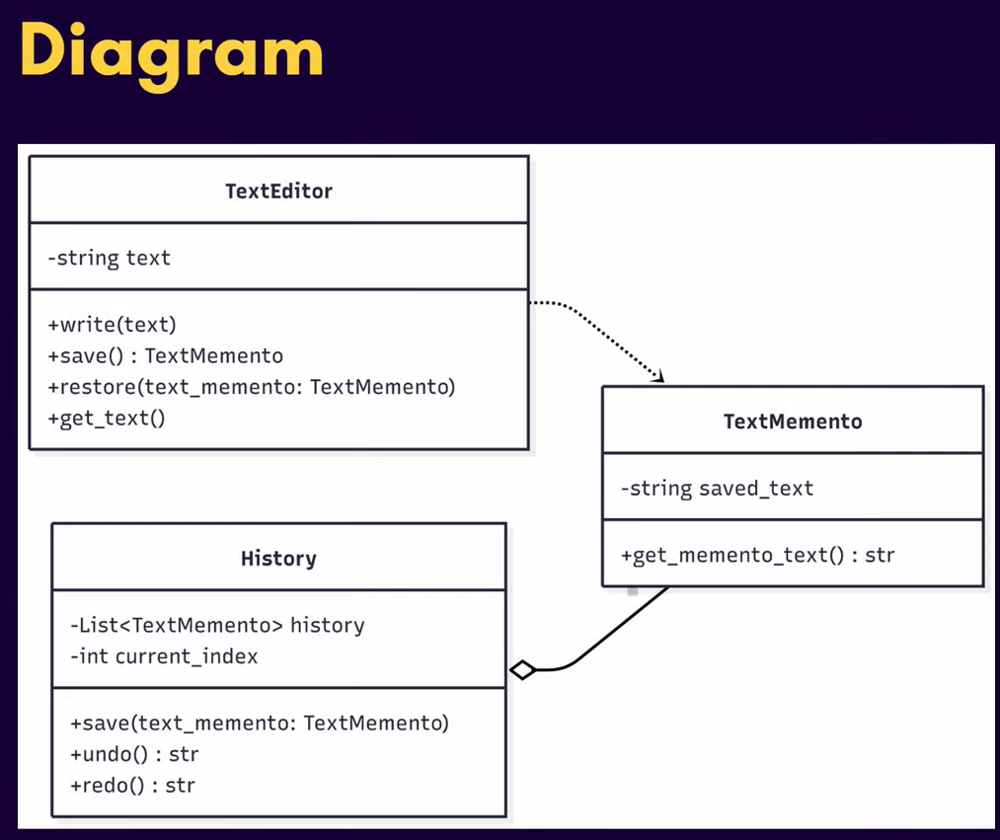

# Memento Design Pattern

The Memento Design Pattern is a behavioral design pattern that lets you capture and store an object's internal state so it can be restored later, without violating encapsulation.

It is particularly useful when you need to:

- Implement undo/redo functionality
- Support checkpointing or versioning of an object's state
- Separate state storage from state management logic

---

---

