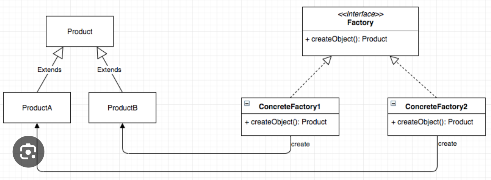

# Factory Design Pattern

## Overview

The Factory Design Pattern is a creational pattern that hides object creation behind a dedicated factory class or method.

Instead of instantiating objects directly with `new` inside your business logic, you ask a factory to create the right object for you. This keeps the client code focused on what it does, not on how objects are built.

## When to Use It

- You want to avoid tight coupling with concrete classes.
- Object creation has conditional logic or setup that should stay in one place.
- You expect new product types to be added over time.
- You want to keep client code simple and easier to maintain.

## Key Idea

The client depends on an interface or abstract type, while the factory decides which concrete class to instantiate.

## Core Components

- Product: The interface or abstract class shared by all created objects.
- Concrete Product: The actual class returned by the factory.
- Factory: The class or method responsible for object creation.
- Client: The code that uses the factory instead of creating objects directly.

## Example

Imagine a notification system:

- `Notification` is the product interface.
- `EmailNotification` and `SMSNotification` are concrete products.
- `NotificationFactory` decides which notification object to return.

The client asks the factory for a notification and then calls `send()` without worrying about which class was created.

## Benefits

- Loose coupling between client code and concrete classes
- Centralized creation logic
- Easier maintenance and extension
- Better support for the Open/Closed Principle

## Variations

- Simple Factory: A single function or class returns different objects based on input.
- Factory Method: Subclasses decide which object to create.
- Abstract Factory: Creates families of related objects without exposing concrete classes.

## Quick Summary

Use a factory when object creation should be hidden, reusable, and easy to extend.
