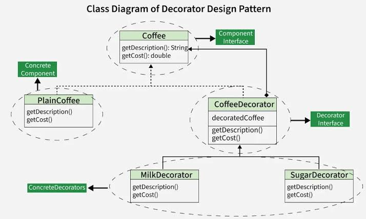

# Decorator Design Pattern

The Decorator Pattern is a structural design pattern that lets you attach new behaviors to objects dynamically by placing them inside special wrapper objects.

It relies on **composition over inheritance** to prevent the **"class explosion"** problem, where you would otherwise need to create many subclasses for every possible combination of features.

---

## 1. Core Idea

The main idea is to wrap an object with another object that has the same interface.

This allows you to add responsibilities to individual objects at runtime without changing their original code.

---

## 2. Class Diagram Architecture

The key structural trick is that the decorator implements the same interface as the target object while also holding a reference to an instance of that interface inside itself.

- **Component Interface:** Defines the common interface for both the core object and its wrappers.  
  Example: `Coffee`
- **Concrete Component:** The base object being wrapped.  
  Example: `PlainCoffee`
- **Base Decorator:** Wraps a `Component` instance and delegates calls to it.  
  Example: `CoffeeDecorator`
- **Concrete Decorators:** Extend the base decorator to add extra logic before or after delegating work to the wrapped component.  
  Example: `MilkDecorator`, `SugarDecorator`

---

## 3. Real-World Example

Think of a **coffee shop**:

- A basic coffee is the core object.
- Milk, sugar, whipped cream, and caramel are optional add-ons.
- Instead of creating a separate class for every combination, you wrap the coffee with decorators.

Example combinations:

- Plain Coffee
- Coffee + Milk
- Coffee + Sugar
- Coffee + Milk + Sugar

---

## 4. When to Use

Use the Decorator Pattern when:

- You need to assign extra responsibilities to individual objects dynamically at runtime.
- You want to avoid subclass explosion caused by many feature combinations.
- You want to keep the original object unchanged while extending its behavior.
- You need flexible and reusable behavior layering.

---

## 5. Benefits

- Adds behavior dynamically
- Follows the Open/Closed Principle
- Avoids subclass explosion
- Promotes code reuse
- Uses composition instead of inheritance

---

## 6. Drawbacks

- Can create many small wrapper classes
- Harder to debug because behavior is layered
- Order of decorators may affect the final result

---

## 7. Design Pattern Image

